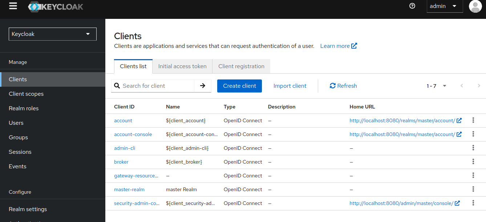
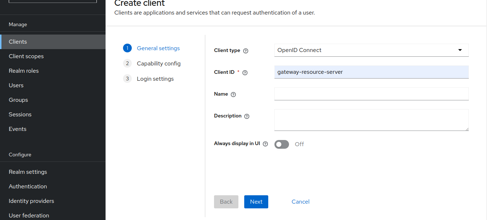
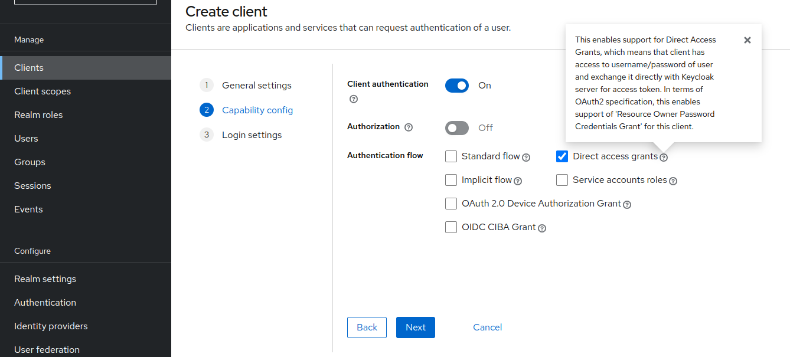
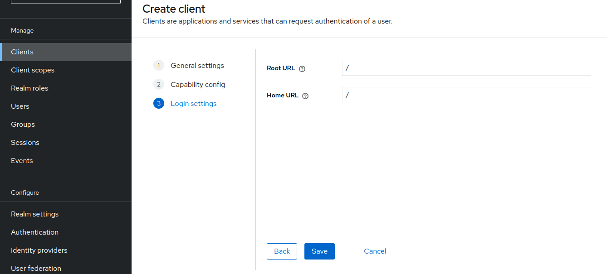

**Expense tracker** is a tool, you can use to save your monthly expenses, create categories and set thresholds
for the categories like when you want to be alerted if you spent more than 100 USD on Coffee this month
it will automatically reset the monthly expenses on start of each month 

### Build
the docker images are pushed to docker hub, all you need to do is to run the 'docker compose up' command
and then all services will run together

### Authentication and Authorization
This guide explains how to get and refresh an access token
and how to use it to authenticate in gateway service.
          

#### step 1: getting the token
prerequisites

ensure the keycloak is running

then you need to create a client in keycloak like this:

Token Endpoint

keycloak provides an endpoint to obtain an access token, use the following parameters in a POST request
             
    curl --location 'http://localhost:8080/realms/master/protocol/openid-connect/token' \
    --header 'Content-Type: application/x-www-form-urlencoded' \
    --data-urlencode 'grant_type=password' \
    --data-urlencode 'username=admin' \
    --data-urlencode 'password=admin123' \
    --data-urlencode 'scope=openid email profile' \
    --data-urlencode 'client_secret=<get from keycloak>' \
    --data-urlencode 'client_id=gateway-resource-server'
                          
client_id: your keycloak client id
client_secret: your keycloak client secret

now you have both refresh and access tokens

    {
      "access_token": "<access_token>",
      "refresh_token": "<refresh_token>", 
      "expires_in": 300,
      "refresh_expires_in": 
      "token_type": "Bearer"
    }

#### step3: refresh the access token
when an access token expires, use the refresh token to get a new token

    curl --location 'http://localhost:8080/realms/master/protocol/openid-connect/token' \    
    --header 'Content-Type: application/x-www-form-urlencoded' \                             
    --data-urlencode 'grant_type=refresh_token' \                                                 
    --data-urlencode 'refresh_token=<refresh_token>' \                                          
    --data-urlencode 'client_secret=E1L1o42Mp3Fq5bAzj04QrGD4sV9cWwEo' \                      
    --data-urlencode 'client_id=gateway-resource-server'                                     
                                
add the token in your Authorization header and enjoy the application

#### swagger documentation
use ip:port/swagger-ui/index.html to get to know the requests structure 

                 

                                        